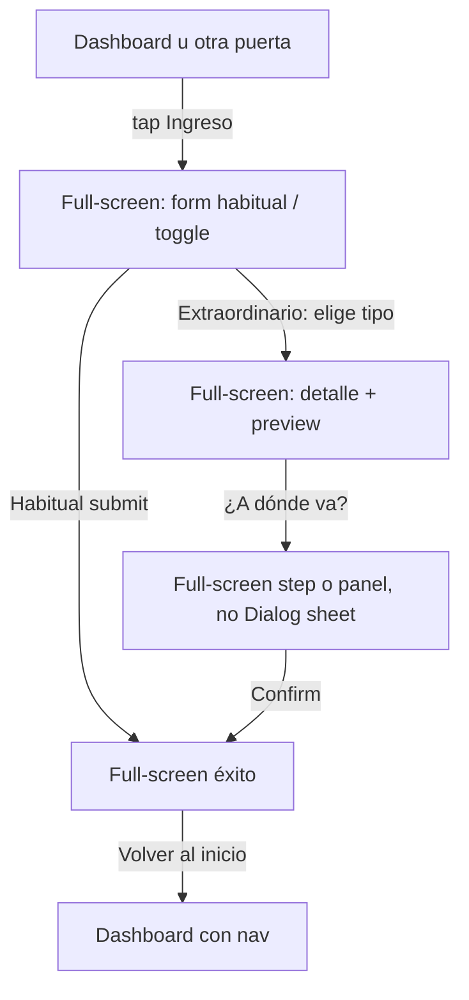

# Plan UX/UI — Registro de ingreso móvil full-screen (sin bottom sheet)

> **Fecha:** 2026-07-26 · **Estado:** plan de UX (pendiente implementación)  
> **Bloque:** 5 — Ingresos · **Canon:** `docs/QUIPU-MASTER.md` §3.5 / §3.7  
> **Relacionado:** `2026-07-21-ingresos-bloque-5-design.md` (ya decía «full-screen, no sheet»)

---

## 1. Diagnóstico (qué pasa hoy)

| Superficie | Comportamiento real |
|---|---|
| Desktop sidebar | Ítem **Registrar** → `/income/register` (página en el layout con sidebar) |
| Bottom nav móvil | **Sin** ítem de ingreso (Inicio · Ahorros · FAB · Compromisos · Ajustes) — alineado al canon |
| FAB móvil | Con ciclo activo → **abre gasto** en bottom sheet (`ExpenseRegisterShell`, `max-h-[92dvh]`). Sin ciclo → navega a ingreso |
| `/income/register` | Es **ruta de página**, no `Sheet`. Pero vive dentro de `AppLayoutShell`: bottom nav fijo + `main` con `pb-24` |

**Dos problemas distintos:**

1. **Descubrimiento:** con ciclo activo, en móvil casi no hay puerta clara al ingreso (el FAB “se come” el verbo Registrar = gasto). En desktop sí hay “Registrar” en sidebar.
2. **Contención visual:** al abrir `/income/register` en móvil, la bottom nav sigue visible. El formulario alto (toggle, monto, chips, preview, CTAs, y a veces destino extraordinario) compite con ~76px+ de chrome. En pantallas chicas se siente como un **pseudo-sheet**: scroll apretado, CTAs tapados, preview lejos del teclado. El usuario lo describe correctamente como “bottom sheet mala”, aunque técnicamente no use `Sheet`.

El canon ya lo resolvió en papel: **«Móvil: full-screen, no sheet»** (§3.7 Bloque 5). El código no cumple la inmersión.

**Fuera de alcance de este plan:** el bottom sheet de **gasto** (Bloque 4) se mantiene; es intencional (`max-h-[92dvh]`, flujo <10s).

---

## 2. Principios de decisión

1. **Una pregunta por pantalla** — en ingreso: «¿Cuánto entró y a dónde va?» sin chrome de navegación secundaria.
2. **Full viewport = 100% `dvh`** — sin bottom nav, sin FAB, sin “asa” de sheet, sin radio superior de card flotante.
3. **Bottom bar no gana un 5º ítem de ingreso** — el diseño oficial no lo muestra; no lo inventamos.
4. **Gasto ≠ ingreso en affordance** — gasto = sheet rápido desde FAB; ingreso = viaje full-screen desde CTA explícito.
5. **Back explícito** — salir del flujo siempre visible (no depender de gesto de sheet).

---

## 3. Solución UX recomendada

### 3.1 Contenedor: layout inmersivo (no sheet)

Crear un modo de shell para rutas transaccionales de ingreso (y reutilizable después para edición de ingreso):

```
/income/register  →  ImmersiveAppFrame
  - Sin AppBottomNav
  - Sin FAB
  - Sin padding-bottom de nav
  - min-h-dvh, fondo canvas/card según canon
  - Header sticky: [← Volver] + título corto opcional
  - Body scroll interno 1 columna (móvil)
  - Footer sticky opcional solo para CTA primario si el teclado lo requiere
```

**Implementación sugerida (sin imponer API):**

- Opción A (preferida): route group `app/(app)/(immersive)/income/register` con layout propio que **no** monte `AppBottomNav`, o flag en `AppLayoutShell` (`hideChrome` cuando `pathname` match `/income/register`).
- Opción B: portal full-screen fijo `inset-0 z-50` encima del shell. Funciona, pero pelea con historial/back y es más frágil. Evitar si A es viable.

**Prohibido en este flujo:**

- `Sheet` / `Drawer` / `max-h-[92dvh]` / handle drag.
- Renderizar el form “como card elevada” sobre el dashboard.

### 3.2 Acceso móvil sin ítem en bottom bar

Mantener bottom nav como está. Añadir **puertas explícitas** al ingreso:

| Entrada | Cuándo | Copy |
|---|---|---|
| CTA header dashboard (móvil) | Siempre (con o sin ciclo) | «Ingreso» o «Registrar ingreso» → `/income/register` |
| Empty / early cycle | Sin ciclo o sin primer ingreso | CTA hero existente |
| Coach (crisis / aviso de cobertura) | Cuando aplique | Ya navega a ingreso en algunos estados — unificar |
| Movimientos vacíos | Lista vacía | CTA existente |
| Sidebar desktop | Sin cambio | «Registrar» |

**No hacer:** long-press del FAB con menú gasto/ingreso (microgestión + affordance opaca).  
**No hacer:** reemplazar el FAB de gasto por ingreso.

Detalle header móvil con ciclo activo:

- Hoy: botón «Registrar» abre **gasto**.
- Propuesta: dos acciones claras en header móvil del dashboard:
  - Primario texto o icon+label: **Gasto** (abre sheet), o dejar el verbo en FAB y…
  - Secundario ghost/link: **Ingreso** → full-screen.
- Alternativa más limpia (recomendada): **FAB = solo gasto**; header móvil muestra **«+ Ingreso»** permanente (no solo en empty). Una pregunta visual: el FAB responde “gastar”; el header responde “entró dinero”.

### 3.3 Flujo de pantallas (móvil)



**Destino extraordinario (`IncomeDestinationDialog`):** en móvil no debe ser un Dialog centrado con padding de desktop (`px-[34px]`). Convertir a:

- **Paso full-screen** dentro del mismo immersive frame, o
- Panel full-bleed bajo el header (misma ruta, `step = destination`).

Misma regla: 100% alto útil, CTAs al fondo con safe-area.

### 3.4 Layout visual móvil (wire conceptual)

```
┌─────────────────────────────┐
│ ←  Registrar ingreso        │  sticky, safe-area top
├─────────────────────────────┤
│ Habitual | Extraordinario   │
│                             │
│ S/  [monto grande]          │
│ origen chips…               │
│                             │
│ Impacto en tus sobres       │
│ …preview…                   │
│                             │
│          (scroll)           │
├─────────────────────────────┤
│ [Cancelar]  [Registrar]     │  sticky bottom, safe-area
└─────────────────────────────┘
   ↑ sin bottom nav debajo
```

Tipografía/tokens: sin cambios de marca; solo composición. Preview apilado bajo inputs (ya grid → 1 col en `lg`).

### 3.5 Desktop

Sin cambio de modelo mental: sidebar «Registrar» → misma ruta. En `md+` el immersive puede:

- Ocultar solo bottom nav (ya oculto), **mantener sidebar**, o
- También full-bleed con back (más dramático; innecesario).

**Recomendación:** immersive chrome-hide **solo `< md`**. Desktop conserva sidebar + contenido.

---

## 4. Qué no cambia

- Bottom nav: 4 ítems + FAB central.
- FAB con ciclo = gasto (sheet).
- Ruta canónica `/income/register`.
- Backend / Convex (este plan es solo presentación + navegación).
- Sheets de ahorro (`SavingsFormShell`) y detalle de compromiso — fuera de scope; evaluar después con el mismo criterio “¿es captura larga?”.

---

## 5. Criterios de aceptación UX

1. En viewport ≤375×667, `/income/register` usa **100% de la altura útil** (`dvh` − safe areas); **cero** píxeles de bottom nav visibles.
2. No existe handle, radio superior tipo sheet, ni `max-h-[92%]`.
3. Con ciclo activo, un usuario móvil llega a ingreso en **≤2 taps** desde dashboard (header «Ingreso» + pantalla).
4. Extraordinario “¿A dónde va?” no abre Dialog/Sheet parcial en móvil.
5. Al completar o cancelar, vuelve al dashboard **con** bottom nav restaurada.
6. Desktop sidebar «Registrar» sigue funcionando; visual regression menor aceptable.
7. Smoke manual: iPhone SE / Pixel chico — teclado abierto no tapa el CTA primario (footer sticky o scrollIntoView del submit).

---

## 6. Orden de implementación (cuando se ejecute)

1. **Immersive shell** para `/income/register` (hide bottom nav + padding).
2. **Header back** + safe areas.
3. **CTA «Ingreso»** en dashboard móvil con ciclo activo.
4. **Destino extraordinario** → paso full-screen en móvil.
5. Ajustar copy/aria del FAB («Registrar gasto») para no competir semánticamente con ingreso.
6. Actualizar §3.7 / §8.4 del maestro + checklist smoke móvil.

**Estimación de invasividad:** baja–media (layout + CTAs + un dialog→step); sin dominio financiero.

---

## 7. Decisión resumida

> El registro de ingreso en móvil es un **viaje full-screen inmersivo** (sin bottom nav ni sheet).  
> El acceso vive en **CTAs explícitos** (header/empty/coach), **no** en la bottom bar.  
> El FAB y el sheet quedan reservados al **gasto**.
